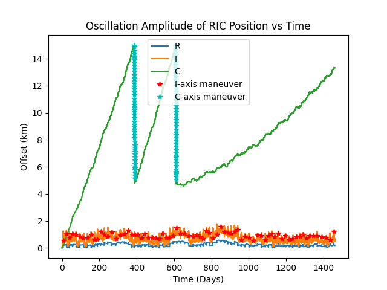
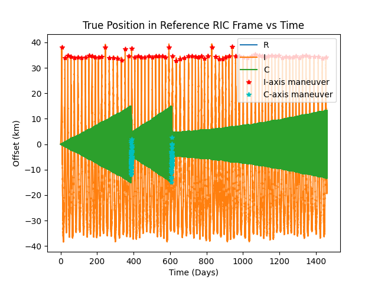
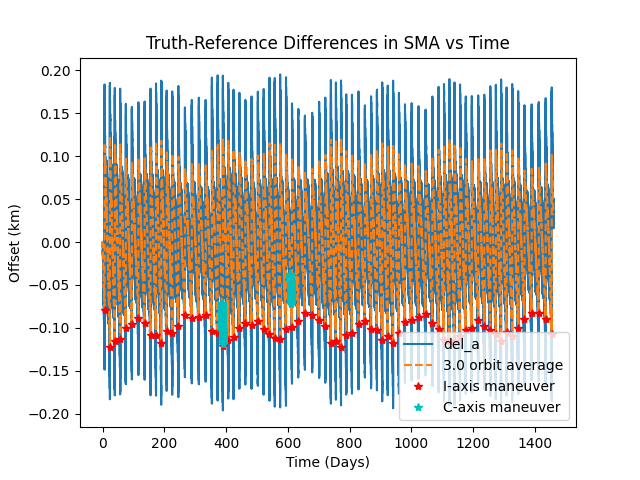
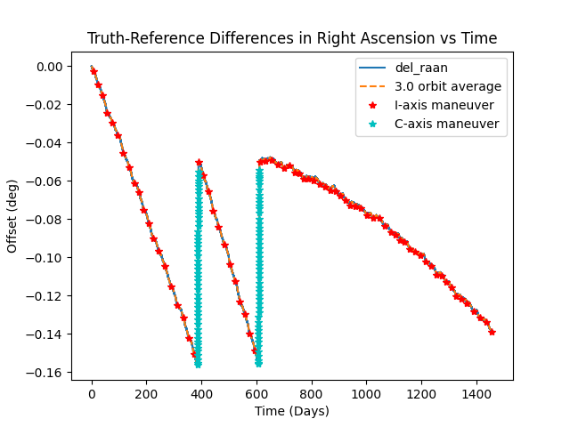
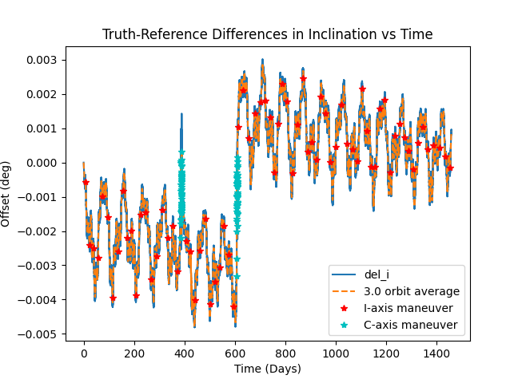
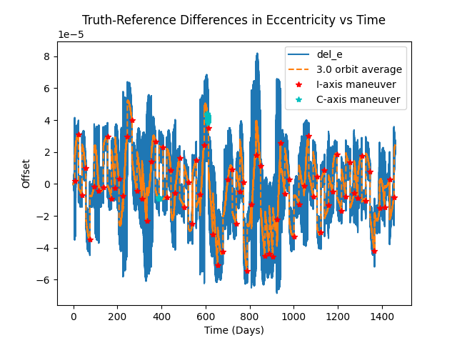

# Single-Vehicle LEO Station Keeping for Constellations
This project analyzes **single-spacecraft station keeping maneuvers for constellation slot-keeping** (planned vehicle by vehicle) in a high-fidelity LEO environment. The dynamics and finite maneuvers are modeled using NASA's **General Mission Analysis Tool (GMAT)** Python API (`gmatpy`).

The simulation models a spacecraft's maneuver behavior by propagating two trajectories: a reference and the truth. The station keeping controller, `leo_station_keeping_controller.py`, monitors the instantaneous and orbital average differences throughout the simulation and commands the spacecraft to perform finite maneuvers as necessary to remain within a user-defined operational box.

**Main entry point:** `station_keeping_simulation.py`
**Control logic (state machine):** `leo_station_keeping_controller.py`
**Tunables:** `simulationParameters.py`

## Features
- Full GMAT API integration for high-fidelity orbit propagation
- Custom satellite, propagator, and force model creation
- Closed-loop thrusting logic for station keeping
- Coordinate transformations (ECI <-> RIC frame)
- Data visualization with Matplotlib
- Designed for constellation ops as a per-vehicle planner

## Concepts
### Reference vs Truth
Each trajectory in the simulation uses a **Runge-Kutta 89** numerical integrator. However, the forces modeled between trajectories will vary.

| Trajectory | Forces Modeled | 
|------------|----------------|
| *Reference* | Earth's gravity (JGM2, **16x16** harmonics) |
| *Truth* | Earth's gravity (JGM2, **16x16** harmonics)<br> Solar/Lunar attraction<br> Jacchia-Roberts atmospheric drag<br> Solar radiation pressure<br> Electric thrusters (*Only while thrusting*)|

The reference is treated as the designed trajectory (gravity only), while the truth feels the fuller set of LEO forces. This fidelity gap is intentional in order to inject model and knowledge error between what the spacecraft was designed against and the environment it actually flies in.

After each step in the simulation, the difference is taken between the truth and reference trajectories. If the truth trajectory's deviation from its reference, measured about the reference's Radial, In-track, Cross-track (RIC) frame, leaves the bounds then station-keeping burns fire to begin returning the truth trajectory to its reference.

### Controller Priorities and Bounds
The maneuver controller prioritizes corrections along each axis in this order, **I > C > R**. In the case the spacecraft is already maneuvering when a new boundary violation occurs, the controller will finish the on-going maneuver and switch which axis is maneuvering to one of higher priority. Once the higher priority maneuver is complete, the controller will return to the interrupted state to let it perform additional maneuvers if necessary.

Default operational bounds and key ratios (see `simulationParameters.py`):
| Parameter | Value | Role |
|-----------|-------|------|
| `R_BOUNDS` | 10 km | R position oscillation-amplitude |
| `I_BOUNDS` | 40 km | ±I position boundary |
| `C_BOUNDS` | 15 km | C position oscillation-amplitude |
| `R_TARGET_RATIO` | 0.5 | R successful recovery (1/2 of `R_BOUNDS`) |
| `I_TRIGGER_RATIO` | 0.85 | I-axis maneuver trigger (85% of `I_BOUNDS`) |
| `I_BURN_STEP_GAIN` | 0.5 | I burn length step gain |
| `C_TARGET_RATIO` | 0.33 | C successful recovery (~1/3 of `C_BOUNDS`) |

### Controller Logic
When the R/C oscillation-amplitude boundaries are violated or when the spacecraft has drifted beyond `I_TRIGGER_RATIO` of `I_BOUNDS`, the controller enters a waiting period to align itself with a maneuver window before engaging the thrusters.

| Maneuver | Thruster Criteria |
|----------|-------------------|
| ±R | - Approaching 90° or 270°<br> - `\|ΔAOP\| <= 3` deg |
| +I | - Approaching perigee or apogee (varies on sign of `Δe`)<br> - No recent maneuvers within 3 orbital periods<br> - `Δa_mean < 0` |
| ±C | - Approaching `crit_angle` (the ideal angle to correct both `Δi` and `ΔRAAN`)<br>|

After an R/C axis maneuver, the controller enters another waiting period to verify that the oscillation amplitude of their respective axis has been reduced, `R_amp / R_BOUNDS <= R_TARGET_RATIO` and `C_amp / C_BOUNDS <= C_TARGET_RATIO`, respectively. If the amplitude has not reduced enough within 75% of an orbit, re-enter a waiting period to look for another maneuver opportunity.

After an I axis maneuver, on the other hand, the controller will propagate out the truth spacecraft's path for at least 4 revolutions and until `Δa_mean < 0`. This point represents when drag has overcome the maneuver and will send the spacecraft drifting in the velocity direction, relative to its reference trajectory. When the drift rate changes, one of three outcomes occurs: an undershoot, an overshoot, or the "goldilocks" arc. If the maneuver results in an undershoot or an overshoot arc, correct the maneuver duration and repeat until a goldilocks arc is achieved.
- *Undershoot* (`-min_i_pos / I_BOUNDS < I_TRIGGER_RATIO`): Back propagate the simulation to the time the maneuver ended. Using `I_BURN_STEP_GAIN` and the miss distance, estimate the needed additional maneuver duration to achieve goldilocks arc.
- *Overshoot* (`-min_i_pos > I_BOUNDS`): Back propagate the simulation to the time the maneuver ended. Using `I_BURN_STEP_GAIN` and the miss distance, estimate the duration the maneuver needs to be shortened by to achieve goldilocks arc.
- *Goldilocks* (`I_TRIGGER_RATIO <= -min_i_pos / I_BOUNDS <= 1`): The apex of the trajectory falls between the targeted bounds. Rewind to the end of the maneuver and resume the simulation as normal.

## Configuration
Edits to the default values can be made in `simulationParameters.py`. Default values of note:

| Variable | Value | Notes |
|----------|-------|-------|
| `MAX_DAYS` | 20 days | Demo duration. Raise for long-run Δv analyses |
| `DT_COAST` | 120 sec | Simulation step size during coast |
| `DT_THRUST` | 5 sec | Simulation step size during thrusting |
| `REVOLUTIONS_TO_AVG` | 3 | Window to average orbital elements differences |
| `STATE_VECT_SOURCE` | "new" | Shared initial `ORBIT_STATE` (a=6903 km, e=1e-3, i=53 deg, aop=0 deg, raan=0 deg, ta=0 deg). Use "existing" and populate `REF_ORBIT_STATE`/`TRUTH_ORBIT_STATE` for fixed epochs |
| `MIN_DUTY_TIME` | 60 sec | Initial burn time used by I-axis maneuvers |
| `MAX_DUTY_TIME` | 3600 sec | Burn duration ceiling |
| `MANEUVER_ARC_HALF_ANGLE` | 20 deg | Lead/drag angle to expand maneuver windows |
| Plot/print flags | See below | Toggles which figures to produce and what to print to the terminal. |

### Plot/Print Flags
#### On
- `PRINT_MANEUVER_MESSAGE`
- `PLOT_RIC_POS`
- `PLOT_RIC_POS_AMP`
- `PLOT_COE_DIFF["del_a"]`
- `PLOT_COE_DIFF["del_e"]`
- `PLOT_COE_DIFF["del_i"]`
- `PLOT_COE_DIFF["del_raan"]`
- `PLOT_MANEUVER_MARKERS`
#### Off
- `PLOT_3D_RIC`
- `PLOT_RIC_VELO`
- `PLOT_RIC_VELO_AMP`
- `PLOT_COE_DIFF["del_aop"]`
- `PLOT_COE_DIFF["del_f"]`
- `PLOT_PHASE_DIFF`
- `PRINT_I_AXIS_MANEUVER_ATTEMPTS`

## Example Results
Over a 4 year run, the controller used 35.3 m/s total Δv: about 8.5 m/s across 75 in-track (`I+`) burns (~every 19 days) and about 26.8 m/s across 98 cross-track (`C-`) burns in two closeout campaigns near day 386 and day 608. No radial (`R`) burns fired in this case. Cross-track work dominates the budget; in-track burns keep the RIC envelope filled without large Δv.

### Keeping Within The RIC Box
<!-- PLOT: ric_position_amplitude_vs_time -->


*Cross-track amplitude grows as a sawtooth to `C_BOUNDS` (15 km), then resets in two multi-burn C campaigns near day 386 and day 608. In-track stays within `I_BOUNDS` (40 km). Any radial amplitude stays near zero for this run.*

<!-- PLOT: ric_position_vs_time -->


*Truth position in the reference RIC frame. I fills roughly ±40 km between I+ burns (~every 19 days). C oscillates with growing envelope until each closeout maneuver sequence. Any deviation along the R axis stays small and manageable.*

### Why Maneuvers Are Triggered
<!-- PLOT: del_a_vs_time -->


*Mean semi-major-axis difference. Drag pulls Δa negative until an I+ burn lifts it. The goldilocks shooter targets the next drift reversal so the I envelope stays inside the box without large Δv.*

<!-- PLOT: del_raan_vs_time -->


*RAAN difference walks under the fidelity gap, then steps down when C burns fire near the critical angle. This marks the clearest signature that cross-track work is correcting plane error, not just amplitude.*

<!-- PLOT: del_i_vs_time -->


*Inclination difference accumulates between C campaigns and is reduced with those same out-of-plane burns (coupled with ΔΩ via the critical-angle targeting).*

<!-- PLOT: del_e_vs_time -->


*Eccentricity difference stays bounded. I burns gate on mean Δa and argument-of-perigee/apogee geometry; eccentricity is watched but is not the primary trigger in this control law.*

## Requirements
- **Python** 3.10+
- **NASA GMAT** R2026a
- Python packages: `numpy`, `matplotlib`

## Setup
1. **Installing GMAT** -
   Download and install the latest version of GMAT from [NASA's SourceForge page](https://sourceforge.net/projects/gmat/)

2. **Create API Connection** -
   Navigate to `.../GMAT Install/application/api` and open BuildApiStartupFile.py. In the terminal enter:
   ```bash
   python BuildApiStartupFile.py
   ```
   Confirm `api_startup_file.txt` exists under `{GmatInstall}/bin`.

3. **Clone Repo** -
   Add this repo to your coding environment:
   ```bash
   git clone https://github.com/leftyonthehill/leo-station-keeping.git
   ```

4. **Connect API to Repo** -
   Copy the path to `.../{GMAT Install}` and paste it in this repo's `load_gmat.py`.

5. **Install libraries** -
   Install supporting **Python** libraries by running the following command:
   ```bash
   pip install numpy matplotlib
   ```
6. **Run** -
   Run `station_keeping_simulation.py` and analyze the station keeping data!
   ```bash
   python station_keeping_simulation.py
   ```
   Interactive Matplotlib windows open for enabled plot flags (`plt.show()`). Code does **not** write PNG files automatically.

## Contributing
Personal project but issues and PRs that improve station-keeping logic, modularity, or docs are welcome.
